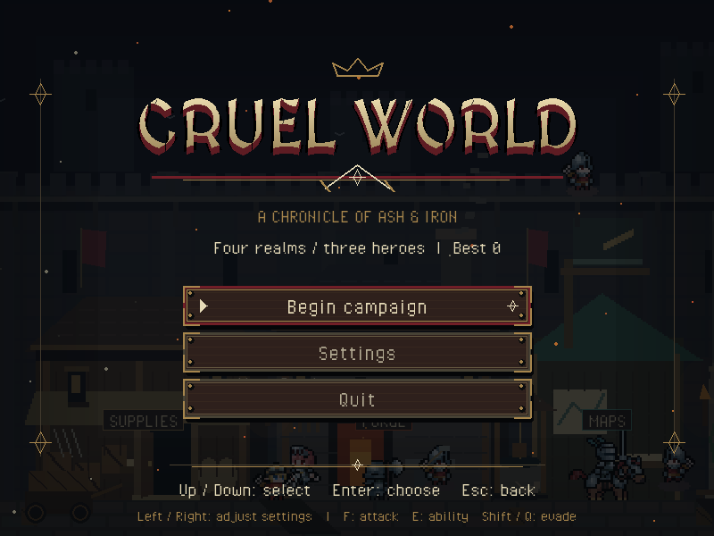
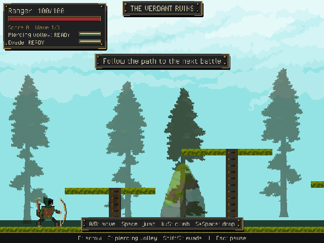
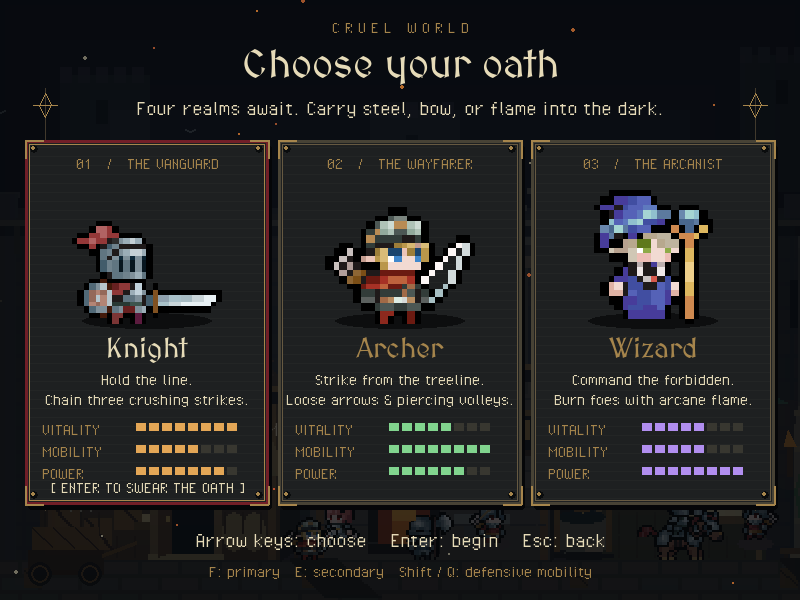
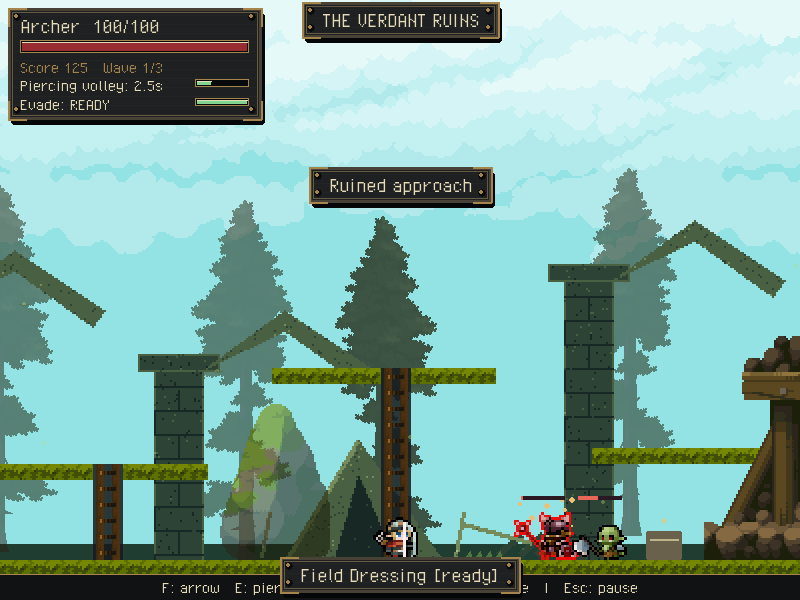
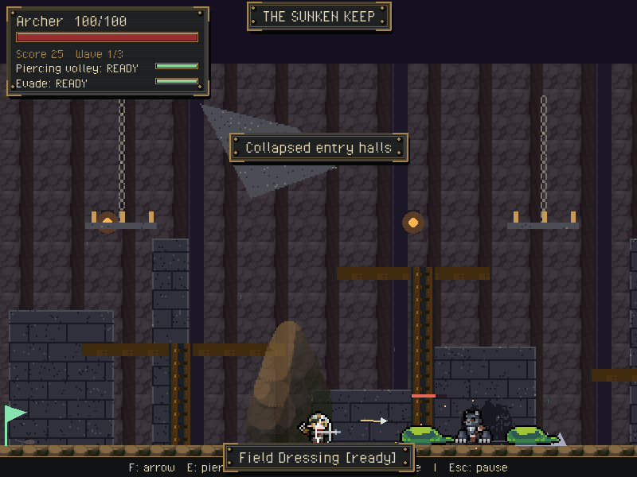
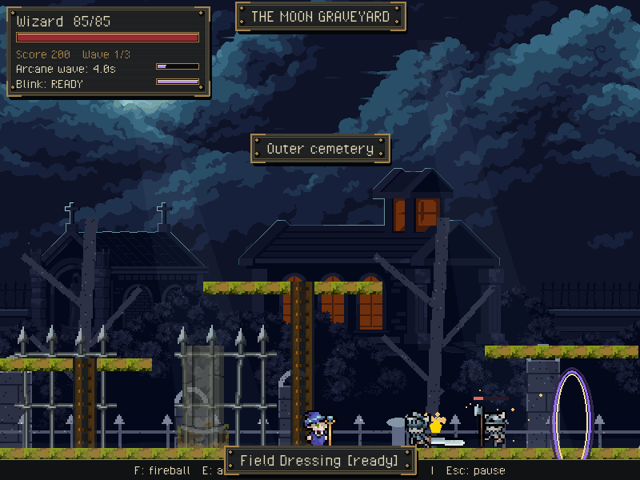
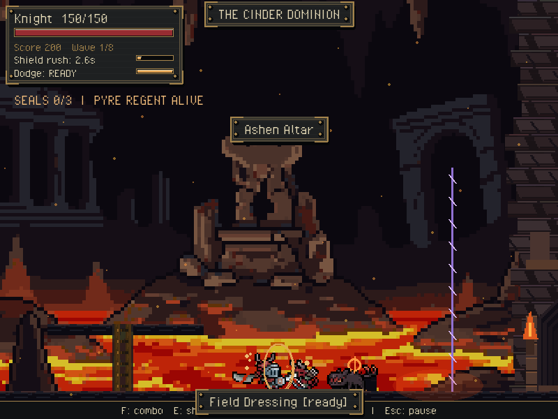
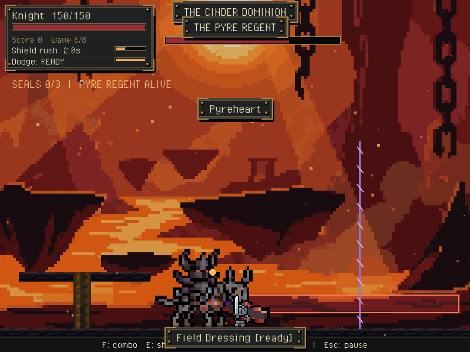
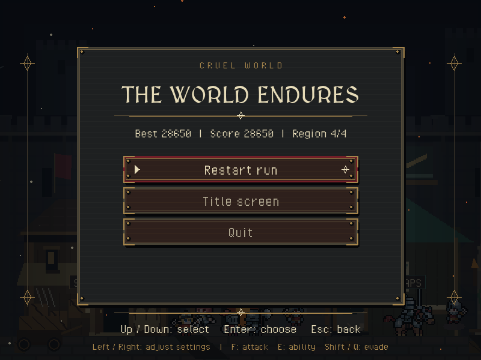

# Cruel World

**[Play the browser alpha](https://jupiternull.github.io/cruel-world/)**

Desktop keyboard required; touch controls are not supported. Browser alpha loading may take a moment, audio requires interaction, and browser saves are session-local. Mechanics, balance, art, and content may change.

## About

Cruel World is a side-scrolling pixel-art dark-fantasy action RPG centered on dangerous exploration, deliberate combat, and mastering powerful enemies.

The current alpha is a compact playable pilot. Choose between the Knight, Archer, and Wizard, prepare at a castle refuge, and fight through four hostile realms with distinct enemies and bosses: the Verdant Ruins, Sunken Keep, Moon Graveyard, and Cinder Dominion.

The Cinder Dominion is the Underworld capstone: eight isolated subareas connected by interactive tunnels, gates, breaches, and ladder-accessed passages. Cool three seals while confronting the full 20-character infernal roster—demons, demonesses, black knights, hellhound, hellbat, blood monsters, Warlock, Ghostfire, lava slime, eyeball monster, Flame Golem, and the Minotaur miniboss—before facing the Pyre Regent. Authored exploration and boss music give this realm its own soundtrack.

The finished game is planned as a vast, procedurally generated open world built from interconnected faction-shaped regions. Players will explore, pursue quests, uncover hidden history, gather materials from defeated creatures, develop their character and equipment, and return to an evolving base camp between expeditions.

## Preview

| Class selection | Verdant Ruins |
| --- | --- |
|  |  |
| Sunken Keep | Moon Graveyard |
|  |  |
| Cinder Dominion / Underworld | Pyre Regent |
|  |  |
| Victory | |
|  | |

## Roadmap

- Refine combat, movement, balance, performance, and browser play.
- Expand character identity, classes, equipment, crafting, and progression.
- Develop the base camp, NPCs, factions, quests, and world lore.
- Create a cohesive original visual identity and custom asset library.
- Build longer connected regions with meaningful exploration and revisiting.
- Introduce seeded procedural world generation and expand toward the full open world.

Development is ongoing. The current alpha represents the foundation rather than the final scope of Cruel World.
